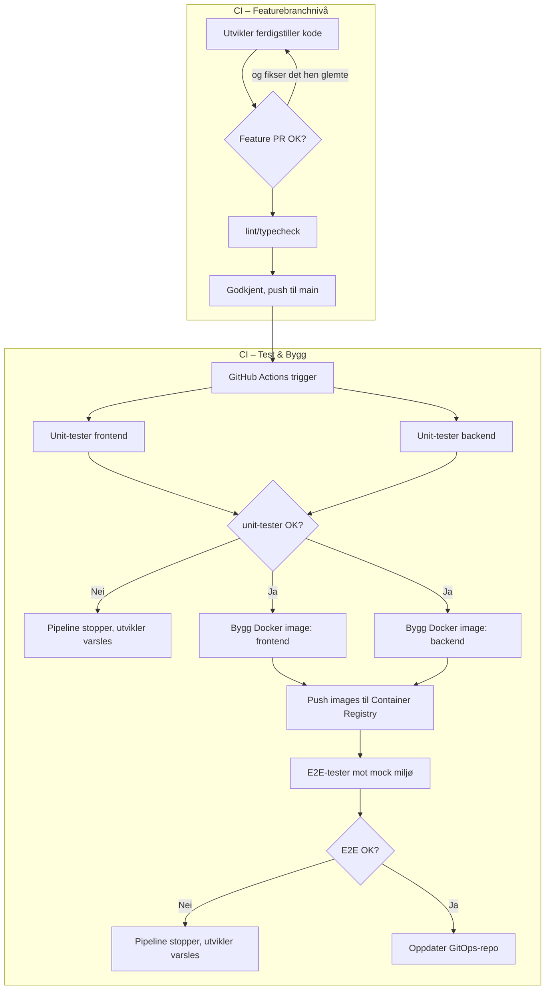

## Bakgrunn ##

- Sikkerhet og pålogging?
- Hva er best practice for Kubernetes og database? Kjører den i en egen container per kunde?

## Oppgave ##
Design en CI/CD-pipeline som starter når en utvikler pusher til main branch, og ender med at alle miljøer er oppdatert. 

Pipelinen skal: 
- Kjøre automatiserte tester (unit og e2e) 
    - unit testing ville jeg også hatt tidligere i løpet. Jeg ville hatt PR mellom feature branch og main for sporbarhet.
- Bygge og pushe Docker images til et Container Registry 
    - Sammenheng mellom DB-Backend-Frontend images. Viktig at de holder følge.
3. Oppdatere GitOps-repoet slik at miljøene får de nye imagene 

## Ting å ta stilling til ##
- Hvilke tester kjører når i pipelinen? (parallelt, sekvensielt?) 
    - Linting, CodeQL, Copilot code review, Playwright, E2E.
    - Kjøre unittesting av db/Backend/Frontend i paralell, dersom dette går gjennom kan vi kjøre en E2E-test.
- Hva skjer hvis testene feiler? Stoppes hele pipelinen? Kan utvikleren overstyre? 
    - Minimum versjon av DB-versjon for å deploye Backend, minimum versjon av Backend for å deploye Frontend (til main) kan ikke overstyres, da det vil gi versjonsfeil
    - Ikke lov å legge ut ting som har kritiske feil. Dette må avklares i teamet, i enkelte situasjoner er det nødvendig med en krise-patch.
- Hvordan oppdateres GitOps-repoet? (manuelt, automatisk, PR?) 
    - Manuelt, Branch protection og minimum 1 approver på PR
- Hvordan bygger du Docker images effektivt? (caching, multi-stage builds?) 
    - Foretrekker å ha en buildserver, cacher versjoner av 3. parts pakker som trengs både for sikring og hastighet. Artifact repo (Nexus f.eks) (Kun et sted som er ansvarlig for å hente pakker fra internett)
    - Multi-stage fra sjeldnest endret til oftest endret for å utnytte caching.
    - Dytt til et registry for å gjenbruke hvis noe ikke er endret.
- Hvordan håndteres secrets og miljøspesifikk config? 
    - github secrets, egne secrets for hvert miljø, .env-filer som ikke sjekkes inn for lokal testiing, azure keyvaults e.l.
    - Alltid bruk git SHA, aldri latest. :)
- Hvordan håndteres database-migrasjoner? 
    - Flyway e.l., versjonering av DB for å kunne holde styr på. Bruke Major-minor-patch for enkelhet på alle nivåer. (1.0.0) 

## Leveranse ##
Vi forventer ingen omfattende utredning. Regn med å bruke rundt 60 minutter. Du kan levere enten: 

Arkitekturtegning (Mermaid, draw.io, Paint, ...) som viser: 
- Pipeline-steg og rekkefølge 
- Hva som trigger hva 
- Repositories og container registry involvert 

Og/eller 1-2 sider tekst som beskriver: 
- Hovedkomponentene i pipelinen 
- Viktige valg du har tatt og hvorfor 
- Utfordringer du ser og hvordan du løser dem 
- Hva du ville forbedret med mer tid 
    - Selve byggingen. Kan alltid forbedres for å bli lynrask.

- Vi er interessert i hvordan du tenker, ikke perfekte løsninger 
- Det er greit å nevne ting du ville googlet, spurt Kl om, eller sjekket dokumentasjon på 
    - På nippet til å lese meg opp på Kubernetes...
    - "Eksempel multi-stage build docker"
    - "Postgresql database kubernetes"
    - "proxyserver pakker javascript" (Husket ikke navnet på Nexus)
    - Har brukt Claude Opus 4.6 for å generere mermaid diagram.
- Ta gjerne utgangspunkt i verktøy du kjenner (GitHub Actions, GitLab Cl, Jenkins, etc.) 
    - Github runners. Selfhosted runners vs github-hosted? Lett å sette opp på en VM, kostnadsdiskusjon
- Tenk på hva som er "godt nok" vs. "ideelt" for et lite team 
    - Smidig utvikling, men uten rom for å gjøre store tabber.
    - Hvilke føringer ligger på teamet fra utsiden?